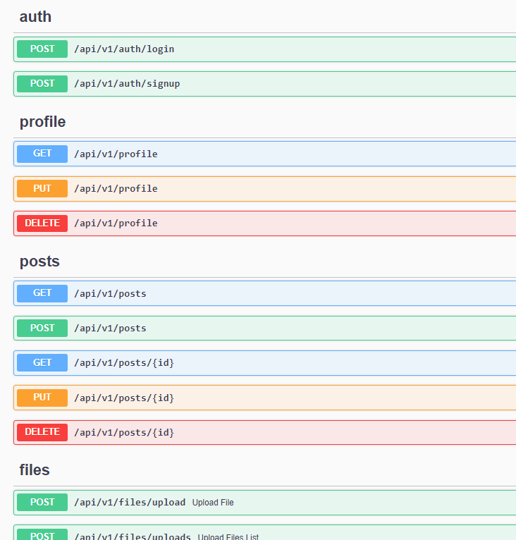

# Demo Api Rest con Nestjs

## Description

Desarrollado para fines demostrativos y prácticos con framework [Nest](https://github.com/nestjs/nest) version 8.0.0, donde se plantean los siguientes requisitos:

- Realizar Api Rest que posibilite registro de usuario, control de accceso, gestión de post y cargas de imágenes para ser publicadas dentro del mismo servidor.

- Utilizar [sequelize](https://sequelize.org/) v6 como ORM.

- Utilizar [Swagger](https://swagger.io/) para describir las operaciones que estarán disponibles en el API.

- Utiliza [JWT](http://jwt.io) con [Passport](http://passportjs.org) como estrategia de autenticación

- Se deben implementar test automáticos.

## Desarrollo

- Se crean modelos con sequelize fuertemente [typados](https://www.npmjs.com/package/sequelize-typescript), con validaciones y documentación swagger: [user](src/modules/users/user.entity.ts), [profile](src/modules/profiles/profile.entity.ts), [post](src/modules/posts/post.entity.ts)

- Se implementa campo virtual (avatarUrl) en modelo [user](src/modules/users/user.entity.ts)

- Se utiliza el middleware [Multer](https://github.com/expressjs/multer) y se implementan [decorators](src/modules/files/decorator) ApiFiles, ApiFileFields y el PipeTransform [ParseFile](src/pipes/parse.file.pipe.ts) para facilitar el manejo de carga de ficheros.

- Se permite acceso estático a las imágenes cargadas en el servidor con el módulo [serve-static](https://www.npmjs.com/package/@nestjs/serve-static).

- Se utiliza patrón [repository](https://github.com/yurisnel/laravel8api/blob/main/app/Repositories/ProductRepository.php) donde se realizan todas las operaciones con modelos y base de datos [auth](src/modules/auth/auth.service.ts), [users](src/modules/users/users.service.ts), [profile](src/modules/profiles/profile.service.ts), [posts](src/modules/posts/posts.service.ts).

- Se utilizan [transaction](src/modules/profiles/profile.service.ts) cuando se realizan más de un operaciones de CRUD en una misma funcionalidad para posibilitar realizar commit/rollback.

- Se implementa módulo de [autenticación](src/modules/auth/auth.module.ts) y se restinguen los Access Point requeridos con:

```bash
  @UseGuards(AuthGuard('jwt'))
```

- Se documentan los controller ( [auth](src/modules/auth/auth.controller.ts), [profiles](src/modules/profiles/profile.controller.ts), [files](src/modules/files/files.controller.ts), [post](src/modules/posts/posts.controller.ts) ) con decoradores de la libreria [nestjs/swagger](https://www.npmjs.com/package/@nestjs/swagger) donde se describen todas las operaciones disponibles en el Api, con nombre de Access Point, método (Get, Post, Post, Delete), parámetros y respuestas con tipos de datos y ejemplos.

- Se implementan [test e2e](src/test/app.e2e-spec.ts) para las operaciones: registro, login, crear post, carga de fichero.

## Implementación de la solución

1. Clonar repositorio: https://github.com/yurisnel/InstaShareApiNest
2. Descargar dependencias:

```bash
$ npm install
```

3. Para ejecutar servidor:

```bash
# development
$ npm run start

# watch mode
$ npm run start:dev

# production mode
$ npm run start:prod
```

4. Para ejecutar test:

```bash
# unit tests
$ npm run test

# e2e tests
$ npm run test:e2e

# test coverage
$ npm run test:cov
```

5. Abrir api doc en navegador en: http://localhost:3000/api/



**PD:** Esta Api Rest es utilizada por el proyecto https://github.com/yurisnel/InstaShareAngular
